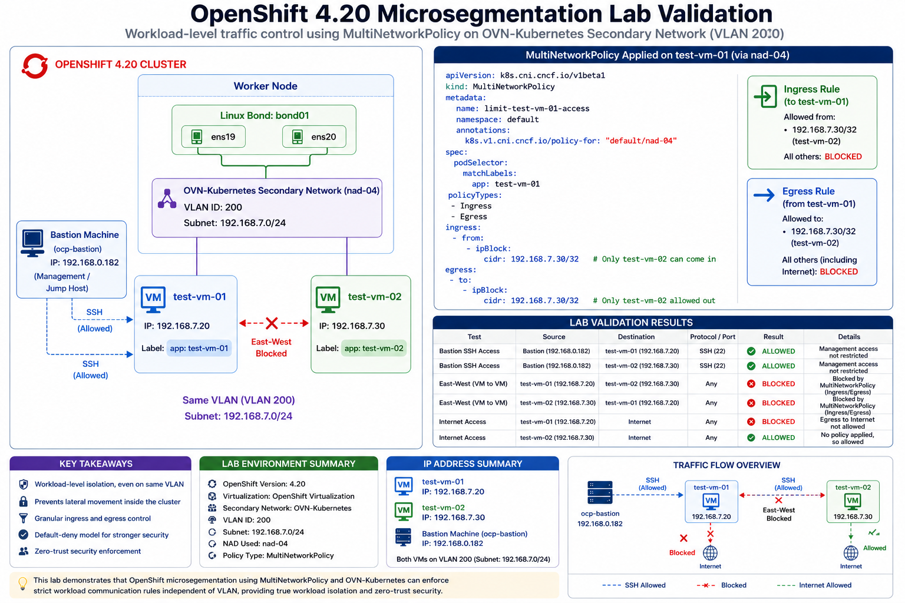

# Native Microsegmentation in Red Hat OpenShift 4.20: Lab Validation

This repository contains the technical brief and configuration files for a real-world lab validation of native distributed microsegmentation using **OpenShift Virtualization** and **OVN-Kubernetes secondary networks**.

---

## 1. Environment Topology

The lab was executed on OpenShift Container Platform (OCP) 4.20 using a flat Layer 2 network architecture tied to a physical enterprise VLAN.

* **Underlying Host Network:** LACP Bond (`bond01`) aggregating physical interfaces `ens19` and `ens20`.
* **Network Attachment Definition (NAD):** `default/nad-04` running an `OVN-Kubernetes secondary localnet network` topology over **VLAN 2000**.
* **Management Host:** `ocp-bastion` (IP: `192.168.0.182`)
* **Target Workloads:** * `test-vm-01` (IP: `192.168.7.20`, Label: `app=test-vm-01`)
  * `test-vm-02` (IP: `192.168.7.30`, Label: `app=test-vm-02`)

### High-Level Architecture Diagram


---

## 2. Microsegmentation Policy Configuration

Because the secondary network is an unmanaged, flat Layer 2 `localnet` configuration (no internal `subnets` specified in the NAD), OpenShift relies on explicit Layer 3/Layer 4 IP boundaries. The following `MultiNetworkPolicy` was applied to isolate `test-vm-01` entirely, restricting its ingress and egress traffic **exclusively** to the management bastion host.

```yaml
apiVersion: k8s.cni.cncf.io/v1beta1
kind: MultiNetworkPolicy
metadata:
  name: limit-test-vm-01-access
  namespace: default
  annotations:
    k8s.v1.cni.cncf.io/policy-for: "default/nad-04"
spec:
  podSelector:
    matchLabels:
      app: test-vm-01
  policyTypes:
  - Ingress
  - Egress
  ingress: 
  - from:
    - ipBlock:
        cidr: 192.168.0.182/32 # ALLOW Inbound SSH/Management from Bastion Only
  egress:
  - to:
    - ipBlock:
        cidr: 192.168.0.182/32 # ALLOW Outbound Traffic to Bastion Only
```

---

## 3. Real-World Lab Validation Results
The following test scenarios verify the runtime enforcement of the OVN-Kubernetes stateful firewall rules:

Test Case 1: Bastion Management Plane Verification
Action: Initiated SSH sessions from ocp-bastion (192.168.0.182) to both test-vm-01 and test-vm-02.

Result: SUCCESS. Administrative access is maintained perfectly.

Test Case 2: East-West Lateral Traffic & Internet Isolation
Action: Attempted an internal ICMP ping from test-vm-01 to test-vm-02 (192.168.7.30), and an external ping to public DNS (8.8.8.8).

Result: 100% PACKET LOSS. The implicit default-deny engine natively drops unlisted paths. Conversely, test-vm-02 (unrestricted by policy) reaches public networks successfully (~30ms response).

Test Case 3: VM-to-VM SSH Blocking
Action: Attempted a direct network hop via SSH between the two local VMs sharing the same host hardware and VLAN.

Result: CONNECTION TIMEOUT. East-West lateral network exploration is thoroughly blocked at the vNIC layer.
4. Key Security Takeaways
Distributed Firewalling: Rules are evaluated natively in the Open vSwitch (OVS) data plane at the virtual port level before packets reach the physical switch.

VLAN Membership ≠ Trust: Even when sharing a broadcast domain, workloads are securely micro-segmented based on runtime Kubernetes identity.

Zero-Trust for Hybrid Layouts: OpenShift provides unified, enterprise-grade distributed network security across modern containers and legacy virtual machines without the bloated overhead of traditional, vendor-locked virtualization engines.


---
