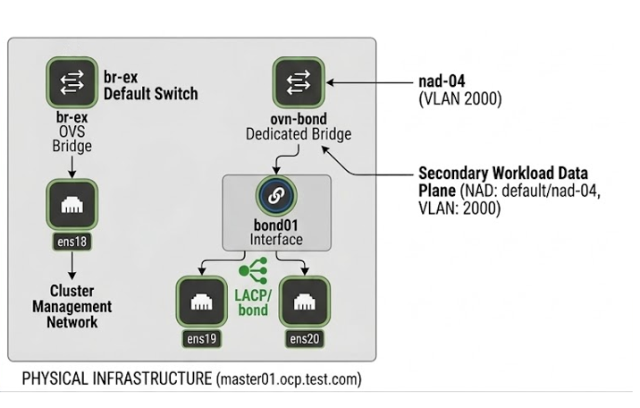

# Native Microsegmentation in Red Hat OpenShift 4.20: Lab Validation

This repository contains the technical brief and configuration files for a real-world lab validation of native distributed microsegmentation using **OpenShift Virtualization** and **OVN-Kubernetes secondary networks**.

---

## 1. Environment Topology

The lab was executed on OpenShift Container Platform (OCP) 4.20 using a flat Layer 2 network architecture tied to a physical enterprise VLAN.

* **Underlying Host Network:** LACP Bond (`bond01`) aggregating physical interfaces `ens19` and `ens20`.
* **Network Attachment Definition (NAD):** `default/nad-04` running an `OVN-Kubernetes secondary localnet network` topology over **VLAN 2000**.
* **Management Host:** `ocp-bastion` (IP: `192.168.0.182`)
* **Target Workloads:** * `test-vm-01` (IP: `192.168.7.20`, Label: `app=test-vm-01`)
  * `test-vm-02` (IP: `192.168.7.30`, Label: `app=test-vm-02`)

### High-Level Architecture Diagram


---

## 2. OVN-Kubernetes and Bond Topology

The following diagram shows the worker node networking topology used during validation, including the Linux bond (`bond01`), physical interfaces (`ens19`, `ens20`), OVN integration bridge, and external bridge configuration.



The OVN-Kubernetes secondary network was attached through a bonded Linux interface (`bond01`) backed by physical NICs `ens19` and `ens20`.

Traffic from the secondary VLAN-backed network is forwarded through OVN/Open vSwitch (OVS), enabling policy enforcement through MultiNetworkPolicy while maintaining integration with the enterprise Layer 2 network.

---

## 3. Microsegmentation Policy Configuration

Because the secondary network is an unmanaged, flat Layer 2 `localnet` configuration (no internal `subnets` specified in the NAD), OpenShift relies on explicit Layer 3/Layer 4 IP boundaries. The following `MultiNetworkPolicy` was applied to isolate `test-vm-01` entirely, restricting its ingress and egress traffic **exclusively** to the management bastion host.

```yaml
apiVersion: k8s.cni.cncf.io/v1beta1
kind: MultiNetworkPolicy
metadata:
  name: limit-test-vm-01-access
  namespace: default
  annotations:
    k8s.v1.cni.cncf.io/policy-for: "default/nad-04"
spec:
  podSelector:
    matchLabels:
      app: test-vm-01
  policyTypes:
  - Ingress
  - Egress
  ingress: 
  - from:
    - ipBlock:
        cidr: 192.168.0.182/32 # ALLOW Inbound SSH/Management from Bastion Only
  egress:
  - to:
    - ipBlock:
        cidr: 192.168.0.182/32 # ALLOW Outbound Traffic to Bastion Only
```

---

## 4. Lab Validation Results

The following validation scenarios were executed to verify traffic enforcement behavior on the OVN-Kubernetes secondary network (`nad-04`) using `MultiNetworkPolicy`.

### Test Case 1 — Bastion Management Access

**Source:** `ocp-bastion (192.168.0.182)`  
**Destination:** `test-vm-01`, `test-vm-02`  
**Protocol:** SSH (TCP/22)

**Result:** ✅ Allowed

Administrative SSH access from the bastion host to both virtual machines remained operational after policy enforcement. This confirms that explicitly permitted management traffic continues to function normally.

---

### Test Case 2 — East-West Traffic Isolation

**Source:** `test-vm-01 (192.168.7.20)`  
**Destination:** `test-vm-02 (192.168.7.30)`  
**Protocol:** ICMP / SSH

**Result:** ❌ Blocked

Although both virtual machines are connected to the same VLAN (`VLAN 200`) and share the same Layer 2 broadcast domain, all direct east-west communication attempts were denied by the applied `MultiNetworkPolicy`.

This validates workload-level isolation independent of VLAN membership.

---

### Test Case 3 — Internet Egress Restriction

**Source:** `test-vm-01 (192.168.7.20)`  
**Destination:** External Networks / Internet  
**Protocol:** ICMP / General Egress

**Result:** ❌ Blocked

External connectivity attempts from `test-vm-01`, including ICMP requests to public destinations such as `8.8.8.8`, failed successfully due to the restrictive egress policy.

Only explicitly permitted destinations defined in the policy were reachable.

---

### Test Case 4 — Unrestricted Workload Validation

**Source:** `test-vm-02 (192.168.7.30)`  
**Destination:** Internet

**Result:** ✅ Allowed

Because `test-vm-02` was not targeted by the `MultiNetworkPolicy`, outbound internet connectivity remained fully operational.

This confirms that policy enforcement was applied selectively only to the labeled workload (`app=test-vm-01`).

---

### Validation Summary

| Test Scenario | Expected Result | Actual Result |
|---|---|---|
| Bastion → test-vm-01 SSH | Allowed | ✅ Success |
| Bastion → test-vm-02 SSH | Allowed | ✅ Success |
| test-vm-01 → test-vm-02 | Blocked | ✅ Blocked |
| test-vm-01 → Internet | Blocked | ✅ Blocked |
| test-vm-02 → Internet | Allowed | ✅ Success |


---

## 5. Conclusion
This lab demonstrates that Red Hat OpenShift provides effective cloud-native microsegmentation capabilities for virtualized workloads using OVN-Kubernetes and MultiNetworkPolicy enforcement.

---
